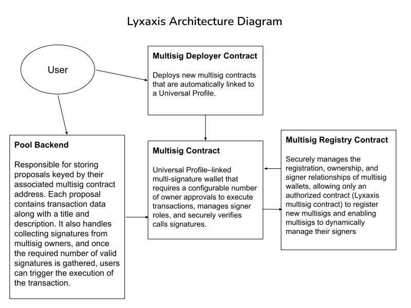

# Lyxaxis

## `The multi-signature wallet for universal business profiles - DAOs!`

### Key Features

- **Clone Multi-sig:** With ONE click, Users can clone the lyxaxis multi-sig contract for their DAO.

- **Render Multi-sig Dashboard:** Users can provide a valid multi-sig contract address to render the dashboard which will display the multi-sig balance, blockie, address, ENS, assets and more. However, write actions are limited to the contract owners only.
- **Sign and Execute Proposals:** DAO managers can make proposals to be signed by other managers. Once the number of signers is valid, anyone can execute the proposal
- **Add and Remove Signers:** DAO managers can propose to add or remove signers.
- **Update Required Signatures:** DAO managers can update the number of signatures required to execute a proposal.
- **Transaction History:** Anyone can view the past proposals and transaction history of the Lyxaxis multi-sig of each DAO.

### Architecture Diagram

### How Lyxaxis Differs from Key Manager

Lyxaxis represents a significant evolution from traditional key manager systems in several key ways:

1. **DAO-Centric Design**

   - Unlike traditional key managers that focus on individual or organizational key management, Lyxaxis is specifically designed for DAOs and decentralized organizations
   - It provides a complete ecosystem for DAO governance and asset management rather than just key management

2. **Enhanced Governance Features**

   - **Visitor Proposals:** Allows non-members to submit proposals, democratizing the governance process
   - **Transaction History:** Provides transparent and accessible history of all proposals and transactions

3. **Flexible Signer Management**

   - **Dynamic Signer Updates:** Allows for the addition and removal of signers through proposals
   - **Configurable Thresholds:** Enables adjustment of required signatures for different operations
   - **Multi-Signature Cloning:** One-click deployment of new multi-sig contracts for different DAOs

4. **User Experience**

   - **One-Click Deployment:** Simplifies the process of setting up new multi-sig contracts
   - **Visual Dashboard:** Provides an intuitive interface for monitoring and managing DAO assets
   - **Blockie Integration:** Visual representation of addresses for better user experience

5. **Security Model**

   - **Proposal-Based Changes:** All significant changes require consensus
   - **Transparent Operations:** All actions are recorded and visible in the transaction history
   - **Visitor-Safe Interface:** Read-only access for non-members while maintaining security

6. **Integration Capabilities**
   - **ENS Support:** Integration with Ethereum Name Service
   - **DeFi Protocol Integration:** Ability to interact with various DeFi protocols
   - **Custom Contract Interactions:** Support for arbitrary contract calls through proposals

These differences make Lyxaxis a more comprehensive and specialized solution for DAOs compared to traditional key managers, which typically focus solely on key management and basic multi-signature functionality.
